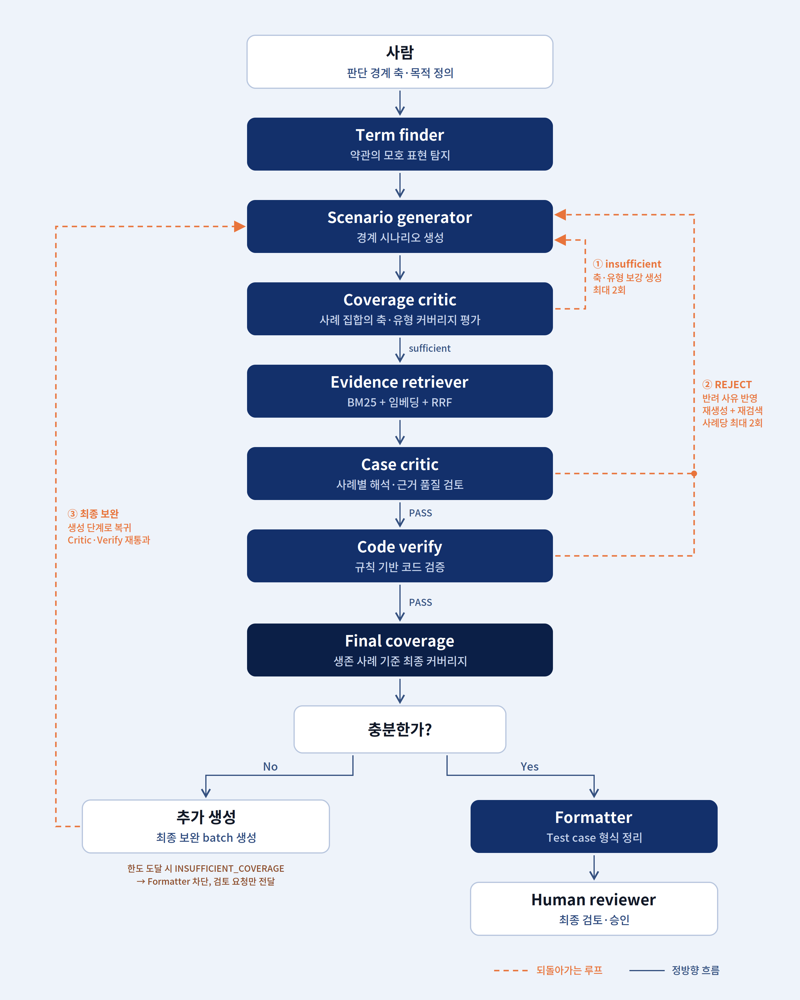
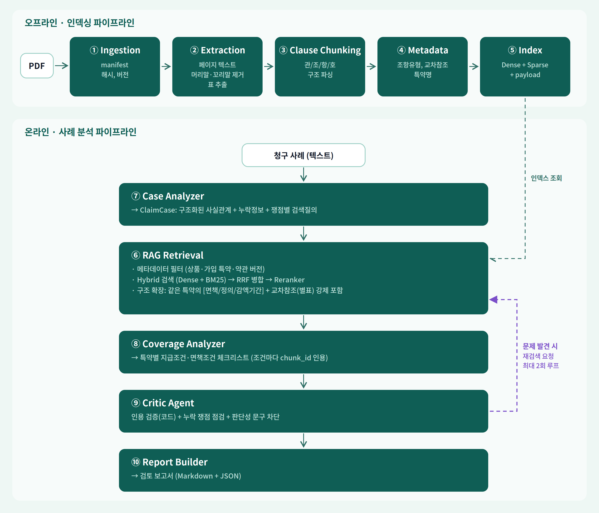
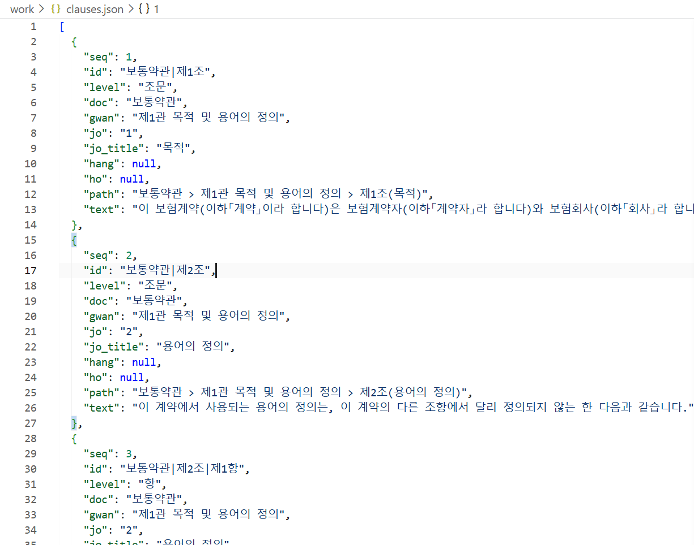

# 예제 3 · 약관 경계사례 탐지 및 테스트 케이스화 Agent

보험 약관 초안에서 **판정 기준이 모호하거나 문서 간에 다르게 정해진 지점**을 찾아내고, 이를 약관 수정 및 검토에 활용할 수 있는 **테스트 케이스로 구조화하는 Agent**입니다.

> **이 Agent는 보험금 지급 여부를 판정하는 도구가 아닙니다.**
> 약관 작성 과정에서 놓칠 수 있는 경계사례를 찾아내고, 추가적인 검토가 필요한 지점을 사람이 확인할 수 있도록 만드는 것을 목적으로 합니다.

`data/policy_sample.pdf`는 교육 실습을 위해 작성한 **가상 약관**입니다. 

---

## README 보기 방법

README는 GitHub에서 바로 확인하거나, VS Code에서 수정하면서 Preview를 함께 확인할 수 있습니다.

### 1. GitHub에서 확인하기

GitHub Repository에 업로드된 `README.md`는 별도의 설정 없이 **Markdown 형식으로 자동 렌더링**됩니다.

따라서 완성된 README를 확인할 때는 GitHub Repository에서 `README.md`를 열면 됩니다.

### 2. VS Code에서 Markdown Preview를 여는 경우

#### 1. README.md 열기

VS Code에서 `README.md` 파일을 열면 왼쪽에서 Markdown 원문을 수정할 수 있습니다.

#### 2. Preview 열기

다음 방법 중 하나를 사용할 수 있습니다.

- **`Ctrl + Shift + V`**  
  → Markdown Preview 열기

- **`Ctrl + K` → `V`**  
  → 편집창과 Preview를 나란히 열기

- 단축키가 동작하지 않는 경우  
  → `Ctrl + Shift + P` → `Markdown: Open Preview to the Side` 검색

Preview를 열면 왼쪽에는 Markdown 원문, 오른쪽에는 실제 렌더링된 README가 표시됩니다.

```text
┌──────────────────────────┬──────────────────────────┐
│      README.md 편집      │      Markdown Preview    │
│                          │                          │
│  # Project               │  Project                 │
│  ## Agent Workflow       │  Agent Workflow          │
│             │  [실제 이미지]            │
│                          │                          │
└──────────────────────────┴──────────────────────────┘
```

### 어디부터 보면 되나요?

이 저장소는 Agent의 전체 구현과 실행 결과를 함께 담고 있습니다. 

**처음 보는 경우에는 아래 순서로 확인하는 것을 권장합니다.**

```text
① 이 README의 [프로젝트 배경]
          ↓
② [Agent Workflow]
          ↓
③ [실행 결과]
          ↓
④ outputs/edge_cases.html
   또는 outputs/demo_output.html
          ↓
⑤ [핵심 구현]
          ↓
⑥ src/ 코드
          ↓
⑦ [개발 과정 및 트러블슈팅]
          ↓
⑧ [Prompt Engineering Log]
    → `PROMPT.txt` / `PROMPT_DEVELOPMENT_LOG.txt`
```

#### 빠르게 이해하고 싶다면


→ `프로젝트 배경` → `Agent Workflow` → `실행 결과`

#### 실제 결과물을 보고 싶다면

→ `outputs/edge_cases.html` → `outputs/demo_output.html`

#### Agent가 어떻게 구현되어 있는지 보고 싶다면

→ `핵심 구현` → `프로젝트 구조` → `src/`


#### 프롬프트가 어떻게 바뀌었는지 자세히 보고 싶다면

→ `Prompt Engineering Log`

> **README를 처음 읽는 사람은 Prompt Engineering Log부터 볼 필요가 없습니다.**
> 이 부분은 구현 과정을 기록해 놓았습니다.

---

## 1. 프로젝트 배경

보험 약관을 검토할 때는 단순히 특정 키워드가 포함되어 있는지를 확인하는 것만으로는 충분하지 않습니다.

예를 들어,

- 동일한 용어가 여러 조항에서 서로 다른 기준으로 사용되는 경우
- 특정 판단 기준이 약관에 명확하게 정의되어 있지 않은 경우
- 기간이나 입원일수처럼 경계 조건에 따라 해석이 달라질 수 있는 경우
- 서로 비슷한 상황이지만 조문 적용 결과가 달라지는 경우

등은 추가적인 검토가 필요합니다.

이 프로젝트에서는 이러한 지점을 사람이 하나씩 찾아내는 대신,

**모호한 표현 탐지 → 사례 생성 → 커버리지 검토 → 관련 조문 검색 → 개별 사례 검토 → 코드 검증**

의 과정을 Agent workflow로 구성했습니다.

---

## 2. Agent Workflow

전체 흐름은 다음과 같습니다.



> **그림 읽는 법**: 가운데 세로 흐름이 기본 실행 순서이고, 주황색 점선은 Coverage가 부족하거나 사례가 반려되었을 때 다시 생성·검증하는 loop입니다.


```text
약관 PDF
   │
   ▼
[1] 모호 표현 탐지
   │
   ▼
[2] Scenario Generator
   │
   ▼
[3] Coverage Critic
   │
   ├── 부족한 판단 축/사례 유형 존재
   │          │
   │          └──────► 추가 사례 생성
   │
   ▼
[4] Evidence Retriever
    BM25 + Dense + RRF
   │
   ▼
[5] Case Critic
   │
   ▼
[6] Code Verify
   │
   ├── Reject ──► 사례 재생성
   │                 │
   │                 └──► 근거 재검색 → 재검토
   │
   ▼
[7] Test-case Formatter
   │
   ▼
[8] Human Reviewer HTML
```

각 단계의 역할은 다음과 같습니다.

| 단계 | 방식 | 역할 |
|---|---|---|
| 모호 표현 탐지 | LLM | 판정에 사용되지만 기준이 불명확하거나 문서 간 차이가 있는 표현 탐지 |
| Scenario Generator | LLM | 탐지된 표현을 바탕으로 다양한 상황의 사례 생성 |
| Coverage Critic | LLM | 전체 사례가 판단 경계 축과 사례 유형을 충분히 포함하는지 검토 |
| Evidence Retriever | Code | 관련 약관 조문 검색 |
| Case Critic | LLM | 개별 사례의 해석 차이와 근거 적합성 검토 |
| Code Verify | Code | 조문 존재 여부, 인용, 날짜 형식, 금지 표현 등 사실관계 검증 |
| Test-case Formatter | Code | 검증된 사례를 구조화된 테스트 케이스로 변환 |
| Human Reviewer | Code | 사람이 최종 사례를 검토할 수 있는 HTML 생성 |

### Agent Loop의 핵심

Coverage가 부족하면 기존 사례를 버리지 않고 부족한 판단 축이나 사례 유형을 다시 Generator에 전달합니다.

개별 사례가 Case Critic 또는 Code Verify에서 반려되면,

```text
반려 사유
   ↓
사례 재생성
   ↓
관련 근거 재검색
   ↓
Case Critic
   ↓
Code Verify
```

순서로 다시 검증합니다.

각 루프에는 상한이 있습니다.

- 처리할 모호 표현: 최대 5개
- 목표 Test Case: 10건
- Coverage 추가 생성: 최대 2회
- 사례별 재생성: 최대 2회

상한에 도달해 실행이 종료되는 것은 실패가 아니라, Agent가 무한히 반복되지 않도록 설정한 종료 조건입니다.

---

## 3. 핵심 구현

### 3.1 여러 단계의 검증 구조

이 프로젝트에서는 하나의 LLM에게 사례 생성과 검토를 모두 맡기지 않고,

**Coverage Critic → Case Critic → Code Verify**

로 검증 단계를 나누었습니다.

#### Coverage Critic

개별 사례가 아니라 **사례 전체의 구성**을 확인합니다.

- 주요 판단 경계가 충분히 다뤄졌는가?
- 특정 판단 축에 사례가 편중되어 있지 않은가?
- 사례 유형이 한쪽으로 치우쳐 있지 않은가?

Coverage가 부족하면 부족한 판단 축과 사례 유형을 Generator에 전달해 추가 사례를 생성합니다.

#### Case Critic

각 사례를 개별적으로 검토합니다.

- 해석 A와 B가 실제로 다른가?
- 시나리오가 구체적인가?
- 제시된 근거가 해당 해석을 뒷받침하는가?
- 약관의 근거보다 결론을 과도하게 확장하지 않았는가?
- 지급/부지급을 최종적으로 단정하고 있지는 않은가?

#### Code Verify

LLM이 판단한 내용을 코드로 다시 확인합니다.

- 인용한 조문이 실제로 존재하는가?
- 인용 ID와 원문이 일치하는가?
- 날짜 형식이 올바른가?
- 금지된 지급/부지급 표현이 포함되어 있는가?

즉, **LLM이 판단하는 부분과 코드로 확인할 수 있는 부분을 분리**했습니다.

Case Critic과 Code Verify에서 일부 검증 항목이 겹치는 것은 의도적인 설계입니다. Case Critic도 Generator와 같은 LLM을 사용하기 때문에, LLM이 만든 오류를 다시 그대로 통과시킬 가능성이 있기 때문입니다.

---

### 3.2 판단 경계 축

현재 구현에서는 다음 6개의 판단 경계 축을 사용합니다.

- 기간경계
- 입원·재입원
- 문서간충돌
- 판정기준부재
- 급부중복
- 판단불가

각 판단 축은 `src/dimensions.py`에 정의되어 있으며 실제 약관의 조항(`anchors`)과 연결되어 있습니다.

> 위 목록은 보험업계의 공식 분류가 아니라 **이번 약관을 대상으로 구현한 설계상의 판단 축**입니다. 다른 약관에서는 다른 축이 필요할 수 있습니다.

실제 약관에서 연결되는 조항을 찾지 못한 판단 축은 실행 과정에서 제외하고 그 사실을 로그에 남깁니다.

---

### 3.3 사례 유형

판단 경계 축과 별도로 사례 유형을 구분합니다.

| 유형 | 의미 |
|---|---|
| 정상사례 | 약관 문언에 따라 비교적 명확하게 판단할 수 있는 사례 |
| 경계사례 | 조건이나 문언에 따라 해석이 달라질 수 있는 사례 |
| 반례 | 유사한 상황이지만 특정 조건의 차이로 조문 적용 결과가 달라지는 사례 |
| 판단불가 | 약관만으로 판단할 수 없어 추가적인 확인이 필요한 사례 |

모든 사례를 경계사례로 구성하면 테스트 세트로서의 역할이 떨어지기 때문에, Coverage Critic이 사례 유형의 균형도 함께 확인합니다.

---

### 3.4 Hybrid Retrieval in RAG

관련 약관 근거를 찾을 때 **BM25 + Dense Retrieval**을 함께 사용하고, 두 검색 결과를 **RRF(Reciprocal Rank Fusion)** 
로 결합합니다.



실제 실행에서는 질의를 입력하면 BM25와 Dense 검색 결과를 각각 확인한 뒤, RRF로 두 결과의 순위를 결합합니다. 아래는 실제 데모 실행 로그입니다.


```text
                    약관 조문
                       │
             ┌─────────┴─────────┐
             ▼                   ▼
          BM25 검색          Dense 검색
             │                   │
             └─────────┬─────────┘
                       ▼
                      RRF
                       │
                       ▼
                관련 조문 목록
```

**BM25**

정확한 단어와 조문 번호를 찾는 데 사용합니다.

**Dense Retrieval**

표현은 다르지만 의미가 유사한 조문을 찾는 데 사용합니다.

**RRF**

두 검색 결과의 점수 스케일이 다르기 때문에 점수를 직접 더하지 않고 검색 순위를 기준으로 결합합니다.

임베딩 모델은 환경변수로 지정할 수 있습니다.

```bash
EMBED_MODEL=BAAI/bge-m3 python src/run.py
```

임베딩 모델을 불러오지 못하는 경우에는 검색 품질이 달라지는 것을 방지하기 위해 BM25로 조용히 대체하지 않고 오류를 발생시킵니다.

`EMBED_BACKEND=fake`는 임베딩 인덱스 캐시 로직을 테스트하기 위한 단위 테스트용 설정이며 실제 의미 검색 검증에는 사용하지 않습니다.

---

## 4. 실행 결과

이 프로젝트를 처음 확인한다면 **코드보다 먼저 `outputs/`의 HTML 결과물을 보는 것을 권장합니다.**

### `outputs/edge_cases.html`

실제 결과물은 브라우저에서 HTML로 열어 확인할 수 있습니다. 터미널의 실행 로그는 Agent가 어떤 판단을 거쳐 결과를 만들었는지 확인할 때 사용하고, `edge_cases.html`은 최종적으로 사람이 사례를 검토할 때 사용합니다.


Human Reviewer가 검토할 수 있는 **경계사례 후보 목록**입니다.

각 사례에서 다음 내용을 확인할 수 있습니다.

- 시나리오
- 해석 A / B
- 관련 근거
- 영향
- 권고사항

여기에 표시되는 사례는 보험금 지급 판단이나 최종 승인된 Test Case가 아닙니다.

약관 수정 및 추가 검토가 필요한 후보 사례입니다.

### `outputs/demo_output.html`

Agent의 **Coverage / QA 실행 결과**를 확인하는 화면입니다.

- Coverage Gate 결과
- 승인된 Test Case
- 반려 사유

등을 확인할 수 있습니다.

Coverage가 충분하지 않은 경우에는 Test Case 생성을 차단하고, 부족한 판단 축과 사례 유형을 확인할 수 있도록 구성했습니다.

### 실제 실행 로그

실행 과정에서는 각 단계의 탐지·생성·Coverage 검토·재검색·Critic·Verify 결과가 터미널에 순차적으로 출력됩니다. 예를 들어 Coverage 부족 시 부족한 사례 유형을 확인하고 추가 생성으로 다시 들어가는 과정을 로그에서 확인할 수 있습니다.


개별 사례가 Reject되면 반려 사유를 반영해 재생성하고, 근거를 다시 검색한 뒤 Case Critic과 Code Verify를 다시 수행합니다.


> 두 HTML은 역할이 다릅니다.
>
> - `edge_cases.html` → **사람이 실제 사례를 검토하는 화면**
> - `demo_output.html` → **Agent의 Coverage / QA 결과를 확인하는 화면**

---

## 5. 주요 산출물

```text
outputs/
├── demo_output.html
├── edge_cases.html
├── test_cases.json
├── edge_cases.json
├── edge_cases.md
├── rejected.json
└── run_log.txt

work/
└── loop_log.jsonl
```

| 파일 | 설명 |
|---|---|
| `outputs/demo_output.html` | Coverage / QA 실행 결과 |
| `outputs/edge_cases.html` | Human Review용 경계사례 화면 |
| `outputs/test_cases.json` | 구조화된 Test Case |
| `outputs/edge_cases.json` | Edge Case 원본 기록 |
| `outputs/edge_cases.md` | 사람이 읽을 수 있는 Edge Case 목록 |
| `outputs/rejected.json` | 반려 사례와 반려 사유 및 반려 주체 |
| `outputs/run_log.txt` | 실행 시 터미널에 출력된 전체 로그 |
| `work/loop_log.jsonl` | Agent loop 실행 기록 |

> 현재 저장소에 포함된 실행에서는 Coverage가 부족해 Test-case Formatter가 차단되었기 때문에, `outputs/edge_cases.md`에는 사례 목록이 생성되지 않고 머리말만 남아 있습니다. 생성된 사례 자체는 `outputs/edge_cases.json`에서 확인할 수 있습니다.

Test Case에서는 날짜, 계약 상태, 사고 원인, 급부 코드 등의 정보를 시나리오 문장과 분리된 필드로 관리합니다.

약관에서 확인할 수 없는 값은 임의로 생성하지 않고 `"미확인"`으로 기록합니다.

또한 기대 결과는 항상 다음과 같이 기록합니다.

```json
{
  "expected_outcome": "검토 필요"
}
```

이 Agent는 지급/부지급을 최종적으로 결정하지 않습니다.

---

## 6. 프로젝트 구조

```text
.
├── .claude/
│   └── skills/
│       └── policy-edge-case-probe/
│           └── SKILL.md
│
├── src/
│   ├── parse_policy.py     # 약관 PDF → 조문 단위 파싱
│   ├── run.py              # Agent 루프 진입점
│   ├── agent.py            # LLM 호출, Generator / Critic
│   ├── dimensions.py       # 판단 경계 축과 사례 유형 정의
│   ├── retrieve.py         # BM25 + Dense + RRF
│   ├── verify.py           # Code Verify
│   ├── format_cases.py     # Test-case Formatter
│   ├── render_review.py    # Human Review용 HTML 생성
│   ├── demo_search.py      # Hybrid Retrieval 데모
│   ├── score.py            # 심어둔 함정 대비 탐지율 채점
│   └── config.py           # 환경변수 및 실행 설정
│
├── data/
│   └── policy_sample.pdf
│
├── images/
│
├── outputs/
│
├── work/
│
├── PROMPT.txt
├── PROMPT_DEVELOPMENT_LOG.txt
└── README.md
```

처음 코드를 확인한다면 다음 파일부터 보는 것을 권장합니다.

| 파일 | 내용 |
|---|---|
| `src/run.py` | 전체 Agent 실행 흐름을 확인할 수 있음 |
| `src/parse_policy.py` | PDF가 어떤 형태로 조문 단위로 변환되는지 확인 |
| `src/agent.py` | 사례 생성과 Critic 호출 로직 확인 |
| `src/dimensions.py` | 판단 경계 축과 사례 유형 확인 |
| `src/verify.py` | 코드 기반 검증 로직 확인 |
| `src/retrieve.py` | BM25 + Dense + RRF 검색 확인 |
| `.claude/.../SKILL.md` | LLM의 역할과 출력 규칙 확인 |

---

## 7. 실행 방법

### 7.1 환경 설치

처음 실행하는 경우 먼저 **VS Code에서 저장소를 연 상태**라고 생각하면 됩니다.

화면에서 알아둘 부분은 두 가지입니다.

- **왼쪽 Explorer(탐색기)**: GitHub Repository 안의 폴더와 파일을 보여주는 영역입니다. `src/`, `outputs/`, `work/`, `data/` 등 프로젝트의 구성 파일을 여기서 확인합니다.
- **아래 Terminal(터미널)**: 실제 명령어를 입력해 Python 코드나 Claude CLI를 실행하는 공간입니다. 명령을 실행하면 그 결과도 터미널에 바로 출력됩니다.

### 터미널에서 무엇을 입력하는가?

이 프로젝트에서는 크게 두 가지 방식으로 터미널을 사용합니다.

**1. 명령어를 직접 실행하는 경우**

```text
python src/parse_policy.py
python src/run.py
```

이 방식은 **미리 정해둔 Python 프로그램을 실행하는 것**입니다. `parse_policy.py`는 약관을 조문 단위로 파싱하고, `run.py`는 이 프로젝트의 Agent workflow를 실행합니다.

**2. Claude CLI에 자연어로 요청하는 경우**

터미널에 `claude`를 입력하면 대화형 Claude CLI를 사용할 수 있고, 이후 자연어로 코드 확인·수정·실행 등에 대한 요청을 입력할 수 있습니다. 한 번의 요청만 전달하려면 `claude -p "테스트" --output-format text`와 같이 사용할 수 있습니다.

> **구분해서 보면 쉽습니다.** `claude`는 개발 과정에서 코드를 확인하거나 작업을 요청하는 CLI이고, 실제 이 프로젝트의 Agent pipeline을 실행하는 명령은 `python src/run.py`입니다.

VS Code의 **Terminal에서 명령어를 입력하고, Explorer에서 생성된 파일을 확인하는 방식**으로 작업합니다.


필요한 Python 패키지를 설치합니다.

```bash
pip install pdfplumber numpy sentence-transformers
```

Claude CLI가 설치되어 있는지 확인합니다.

```bash
claude --version
```

로그인 및 CLI 호출을 확인합니다.

```bash
claude -p "테스트" --output-format text
```

### 7.2 약관 파싱

약관 PDF를 조문 단위 데이터로 변환합니다.

```bash
python src/parse_policy.py
```

처음 한 번 실행하면 다음 파일이 생성됩니다.

```text
work/clauses.json
```

실행 명령과 실제 파싱 결과는 다음과 같습니다.




파싱 결과는 `work/clauses.json`에 저장되며, 이후 검색과 사례 검증에서 조문 단위 근거로 사용됩니다.

### 7.3 Agent 실행

```bash
python src/run.py
```

실행하면 약관 조각 로드 → 판단 경계 축 확인 → 모호 표현 탐지 → 사례 생성 → Coverage 검토 → 근거 검색 → 사례 검토 → 코드 검증의 과정이 터미널에 출력됩니다.


### 7.4 결과 채점

```bash
python src/score.py
```

> Windows PowerShell에서는 경로 구분자가 `\`이므로 필요하면
> `python src\run.py`처럼 실행합니다.

---

## 8. 캐시 및 재현성

### LLM Cache

기존 실행 결과를 재생하려면: 

```bash
python src/run.py --use-cache
```

`--use-cache`를 사용하는 경우 LLM 호출은 다시 수행하지 않고 저장된 응답을 재생합니다.

단, **검색은 캐시를 사용하더라도 실제로 다시 수행합니다.**

### Embedding Index

임베딩 인덱스는 별도로 관리합니다.

| | LLM Cache | Embedding Index |
|---|---|---|
| 위치 | `work/cache.json` | `work/embed_index.npz` |
| 저장 대상 | LLM 응답 | 조각 임베딩 |
| 목적 | 동일 실행 재생 | 검색 전처리 재사용 |
| 무효화 | 사용자가 삭제 | `clauses.json` 해시 또는 모델 변경 |

### 재현성

LLM을 사용하는 시스템이기 때문에 재현성을 세 가지로 구분합니다.

- **Workflow 재현성**: 단계와 분기 조건은 코드에 정의되어 있습니다.
- **LLM 응답 재현성**: 동일 입력에서도 LLM 응답 자체는 비결정적일 수 있습니다.
- **Cache Replay**: `--use-cache`로 저장된 LLM 응답을 다시 사용하여 동일 실행을 재생할 수 있습니다.

따라서 정확한 표현은

> **"동일한 입력이면 항상 동일한 결과가 나온다"가 아니라,
> "LLM 호출 결과를 캐시하여 동일한 실행을 재생할 수 있다"**

입니다.

---

## 9. 개발 과정 및 트러블슈팅

Agent는 한 번에 완성하지 않고 실제 실행 결과를 확인하면서 프롬프트와 검증 구조를 계속해서 수정했습니다.

### V0 — 초기 Agent

```text
모호 표현 탐지
→ 사례 생성
→ Case Critic
→ Code Verify
```

초기 실행에서는 모호 표현 24건을 탐지하고 12건의 사례를 생성했습니다.

하지만 생성된 사례가 대부분 경계사례에 집중되었고,

- 정상사례가 없음
- 반례가 없음
- 판단 경계의 범위를 확인하기 어려움
- 사실관계가 시나리오 문장 안에 섞임

등의 문제가 확인되었습니다.

### V1 — 판단 경계와 Coverage Critic 추가

V0의 문제를 해결하기 위해

- 판단 경계 축 6개
- 사례 유형 4개
- 날짜/계약상태/원인/급부 등의 필드 분리
- Coverage Critic

을 추가했습니다.

Coverage Critic을 통해 개별 사례뿐 아니라 **사례 집합 전체가 어떤 영역을 다루고 있는지** 확인하도록 변경했습니다.

그러나 정상사례와 반례가 계속 생성되지 않는 문제가 남았습니다.

### V2 — 사례 유형별 목표치 추가

Coverage Critic이 부족한 유형과 건수를 Generator에 전달하도록 변경했습니다.

예:

```text
사례 유형 목표치
정상사례 2
경계사례 4
반례 2
판단불가 2
```

Coverage Critic은 다음과 같은 형태로 부족한 유형을 전달합니다.

```json
{
  "missing_types": {
    "정상사례": 2,
    "반례": 2
  }
}
```

이를 Generator가 받아 해당 유형을 추가 생성하도록 변경했습니다.

이후 정상사례와 반례가 처음으로 생성되었습니다.

### V3 — 인용 구조 변경

V2에서 가장 많이 발생한 문제는 **인용 오류**였습니다.

LLM이 약관 원문을 직접 작성하도록 했기 때문에,

- 존재하지 않는 조문 ID를 인용하거나
- 원문을 일부 변경해서 작성하거나
- 실제 검색 결과에 없는 조문을 인용하는

문제가 반복되었습니다.

그래서 V3에서는 모델이 약관 원문을 직접 작성하지 않도록 구조를 변경했습니다.

```text
Generator
   ↓
허용된 조문 ID만 생성
   ↓
Code
   ↓
clauses.json에서 실제 원문 조회
```

또한 Generator에게 인용 가능한 조문 ID 목록을 명시하고, 목록 밖의 조문은 사용할 수 없도록 했습니다.

이렇게 모델이 직접 작성해야 하는 사실관계의 범위를 줄였습니다.

### V3에서 확인한 남은 문제

인용 문제는 줄었지만 새로운 문제가 확인되었습니다.

정상사례와 반례는 경계사례와 평가 기준이 달라야 하는데, Case Critic이 모든 사례를 동일한 기준으로 평가하고 있었습니다.

그 결과 정상사례에서는

> "해석 A와 해석 B가 실제로 서로 다른 결론인가?"

와 같은 기준이 정상사례의 목적과 충돌할 수 있었습니다.

현재 실행에서는

```text
Coverage
6 / 6 판단 경계 축 충족

정상사례
0 / 2

반례
0 / 2

→ INSUFFICIENT_COVERAGE
→ Test-case Formatter 차단
```

으로 종료되었습니다.

현재 확인된 후속 개선 과제는 다음과 같습니다.

- 사례 유형별 Case Critic 기준 분리
- 동일한 반려 사유가 반복되는 사례의 조기 종료 또는 판단불가 처리

---

## 10. Prompt Engineering Log

이 프로젝트의 프롬프트는 한 번에 완성한 것이 아니라, 실제 실행 결과와 검토 과정에서 확인된 문제를 반영하며 단계적으로 구체화했습니다.

처음에는 **모호 표현 탐지 → 사례 생성 → 비평 → 검증**의 기본 구조에서 시작했고, 이후 Coverage Critic, 사례 유형별 coverage, 조문 기반 Evidence Retrieval, Code Verify, Reject–Regenerate–Re-retrieve loop 등을 추가했습니다.

### 버전별 변화

| 버전 | 주요 변경 |
|---|---|
| V0 | 탐지 → 생성 → 비평 → 검증의 초기 구조 |
| V1 | 판단 경계, 사례 유형, 필드 분리, Coverage Critic 추가 |
| V2 | 사례 유형별 목표치와 `missing_types` 추가 |
| V3 | 조문 ID 기반 인용으로 변경, 원문 자동 조회 |
| Final | 역할 분리, Hybrid Retrieval, Reject–Regenerate–Re-retrieve, Test Case 구조화 및 Human Review까지 종합 |

### 관련 문서

| 파일 | 내용 |
|---|---|
| `PROMPT.txt` | 최종 구현에 사용한 종합 프롬프트 |
| `PROMPT_DEVELOPMENT_LOG.txt` | 주요 프롬프트와 설계 변경 과정을 정리한 개발 로그 |
| `.claude/skills/policy-edge-case-probe/SKILL.md` | Agent의 업무 규칙과 출력 제약 |

`PROMPT.txt`에는 최종 구현 요구사항을 한 번에 확인할 수 있도록 목적, workflow, 검증 구조, Retrieval 설정, 출력 규칙, 재현성 조건을 정리했습니다.

`PROMPT_DEVELOPMENT_LOG.txt`에는 단순한 시행착오 기록이 아니라, 실제 구현에 반영된 주요 설계 결정과 그 배경을 중심으로 정리했습니다.

> **처음 README를 읽는 경우에는 Prompt Engineering Log부터 볼 필요가 없습니다.**  
> 프로젝트의 목적과 실행 결과를 먼저 확인한 뒤, Agent 구현 과정이나 프롬프트 설계가 궁금할 때 관련 문서를 참고하면 됩니다.

## 11. 주의사항

- `data/policy_sample.pdf`는 교육용 가상 약관입니다.
- 실제 보험 약관이나 계약자 개인정보를 저장소에 업로드하지 않습니다.
- 생성된 Edge Case와 Test Case는 검토를 위한 초안입니다.
- Agent는 보험금 지급/부지급 여부를 최종적으로 판단하지 않습니다.
- 약관 수정 및 실제 업무 적용 여부는 기존 검토·승인 절차를 따릅니다.
